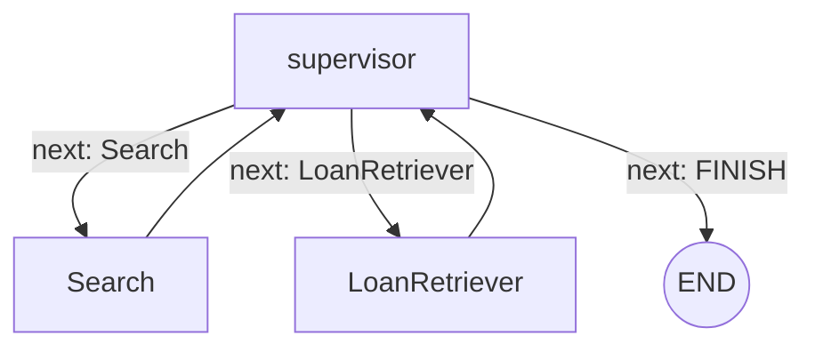
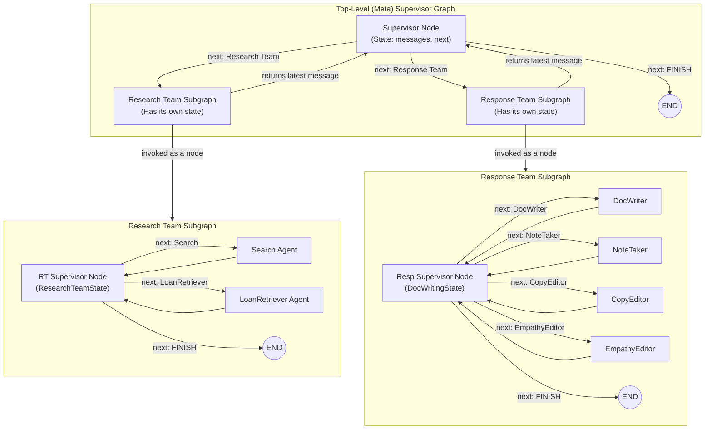

# VIBE_LEARNING.md

This document captures the learning journey, questions, and answers from the current session on LangGraph, multi-agent systems, and related tooling.

---

## Session Q&A Log

### 2. Reviewing the 'rag' Cell

**User:**
Take a look at cell tagged "rag" in the notebook Multi_Agent_RAG_LangGraph

**Assistant:**
The cell tagged "rag" implements a simple RAG (Retrieval-Augmented Generation) pipeline using LangGraph. [Summary of the code and explanation.]

---

### 3. LCEL Pipe Data Flow

**User:**
Can you explain to me how this line of code works: `generator_chain = chat_prompt | openai_chat_model | StrOutputParser()` . I understand we are using Apache beam syntax but how is data passed from one node of the pipe to the next?

**Assistant:**
The line uses LCEL (LangChain Expression Language) syntax, inspired by Unix pipes. Each component receives the output of the previous one. [Detailed breakdown of each step.]

---

### 4. LCEL Pipe Analogy to Unix Pipes

**User:**
so essentially from `chat_prompt` to `openai_chat_model` to StrOutputParser we are just passing a string from sender to reciever like how a ChatGPT chat interaction happens? If so that makes sense cos in unix pipes, you are passing STDOUT to STDIN

**Assistant:**
You’ve got the right intuition! The LCEL pipe is conceptually similar to Unix pipes, but with more flexibility in what’s passed between steps. [Further explanation.]

---

### 5. Understanding Node Input/Output in LCEL

**User:**
So how would I know for each node in the LCEL chain, what are the input and output requirements? For example in the `openai_chat_model` how do I know what its input requirements are and what it will output?

**Assistant:**
Understanding the input and output types for each node is crucial. You can check documentation, type hints, method signatures, or experiment. [Summary table and best practices.]

---

### 6. Assistant as a Resource

**User:**
or I could ask you to help figure it out for me :)

**Assistant:**
Absolutely! That’s exactly what I’m here for. [Encouragement and offer to break down any node.]

---

### 7. Reviewing the 'tiktoken' Cell

**User:**
Can you take a look at the cell tagged 'tiktoken' in the notebook referenced in the last few prompts?

**Assistant:**
The cell is responsible for splitting documents into chunks using token counts, leveraging the `tiktoken` library. [Explanation of code and why token-based chunking is important.]

---

### 8. What is Token-Based Text Chunking?

**User:**
ok can you help me understand what is token based text chunking? I understand RecursiveCharacterTextSplitter looks for logical "sentences" to split the text but I am not sure how token based splitting works. Do we replace the concept of words with that of tokens cos a word could map to more than 1 token correct?

**Assistant:**
Absolutely, let’s break it down! [Explanation of tokens, why token-based chunking is used, and how it differs from word-based chunking.]

---

### 9. Reviewing the 'retrieve_information_tool' Cell

**User:**
Take a look at the cell tagged "retrieve_information_tool"

**Assistant:**
The cell defines a custom tool for use by agents in the LangGraph system. [Code and explanation.]

---

### 10. Design Pattern for @tool

**User:**
what is the design pattern for tools using the @tool annotation?

**Assistant:**
The `@tool` annotation implements a mix of the Command and Decorator patterns, making your function a discoverable, metadata-rich, callable object that agents (and LLMs) can use as a tool. [Full explanation.]

---

### 11. Tool Description via Docstring

**User:**
so in this case the string "Use Retrieval Augmented Generation to retrieve information about student loan policies" is the description?

**Assistant:**
Exactly right! The docstring is the tool’s description, and it’s critical for making your tool discoverable and usable by LLM agents. [Further explanation.]

---

### 12. Requirements for @tool Decorator

**User:**
so what are the code or information needed for the @tool decorator to work (or needs)?

**Assistant:**
For the `@tool` decorator to work, your function needs a definition, type hints, a docstring, and the decorator itself. [Summary table and examples.]

---

### 13. Reviewing the 'research_team_state' Cell

**User:**
Please take a look at the cell tagged 'research_team_state'

**Assistant:**
The cell defines the state structure for the Research Team agent graph. [Code and explanation.]

---

### 14. State Definition Flexibility

**User:**
is the state definition free form or do we need to follow a given structure?

**Assistant:**
The state definition in LangGraph is free form—you can define it however you want, as long as it fits the needs of your workflow and is compatible with your nodes. [Details and examples.]

---

### 15. State as Blackboard

**User:**
So in other words the "State" object acts as a Blackboard

**Assistant:**
Exactly! The "State" object in a LangGraph acts very much like a Blackboard in the classic Blackboard design pattern. [Explanation and summary table.]

--- 

### 16. Choosing LLM and Embedding Models

**User:**
How do we know which LLM model to choose? In this case we chose "gpt-4o-mini" but sometimes eg. for the embedding for the vector store we use the "nano" version

**Assistant:**
Great question! Choosing the right LLM model (or embedding model) depends on the task requirements, cost, speed, and quality trade-offs. Here’s how you can think about it:

---

1. **LLM for Generation/Reasoning (e.g., `ChatOpenAI`)**
   - What matters: Reasoning ability, cost, speed, context window.
   - Typical choices: Use more powerful models (e.g., `gpt-4o`, `gpt-4o-mini`) for complex reasoning; use smaller/faster models (e.g., `gpt-3.5-turbo`, `gpt-4.1-nano`) for cost-sensitive or high-volume tasks.
   - In your notebook: `gpt-4o-mini` is chosen for the research team for a balance of cost and reasoning.

2. **LLM for Embeddings (Vector Store)**
   - What matters: Embedding quality, cost, speed, compatibility.
   - Typical choices: Use smaller/cheaper models (e.g., `nano`, `mini`, `ada-002`) for large-scale or cost-sensitive retrieval; use larger models for highest quality if needed.
   - In your notebook: `nano` is used for embeddings to keep costs low and speed high.

3. **How to Decide?**
   - For generation/agent reasoning: Use the most powerful model you can afford for the complexity of your task.
   - For embeddings: Use the smallest model that gives you “good enough” retrieval quality.

4. **Summary Table**

| Use Case         | Model Type         | Example Model         | Why?                        |
|------------------|-------------------|----------------------|-----------------------------|
| Agent reasoning  | LLM (chat/completion) | gpt-4o, gpt-4o-mini, gpt-3.5-turbo | Reasoning, conversation    |
| Embeddings       | Embedding model   | gpt-4o-embedding, nano, mini, ada-002 | Fast, cheap, scalable     |

5. **Best Practices**
   - Experiment, read docs, and monitor costs/latency.

**In short:**
Choose a more powerful LLM for tasks that need reasoning and a smaller, faster model for embeddings or high-volume, less complex tasks. The right choice is always a balance between quality, speed, and cost for your specific use case. 

### 17. Limits of 'Mini' Models: Examples of Complex Reasoning and Nuanced Understanding

**User:**
Can you give me some examples of tasks that the agent may be asked to perform such that the existing model (the 'mini' model) will reach its limit? Give some examples of what you mean by "more complex reasoning", "nuanced understanding"

**Assistant:**
Absolutely! Here are some concrete examples of tasks where a smaller model like `gpt-4o-mini` (or similar "mini" models) may reach its limits, and where a more powerful model (like full GPT-4o or GPT-4) would perform better:

---

1. **Complex Reasoning Tasks**
   - **Multi-step Problem Solving:**
     - Example: “Given a list of financial aid policies, determine which ones apply to a student with a specific background, and explain the reasoning step by step.”
     - Why hard for mini: Requires tracking multiple conditions, chaining logic, and maintaining context over several steps.
   - **Mathematical or Logical Puzzles:**
     - Example: “If a student takes out a subsidized loan with 3% interest, and an unsubsidized loan with 5% interest, and pays off $200/month, how long until both are paid off?”
     - Why hard for mini: Involves multi-step calculations and logical deductions.

2. **Nuanced Understanding Tasks**
   - **Subtle Sentiment or Tone Analysis:**
     - Example: “Read this student complaint and determine if the tone is more frustrated or disappointed, and explain why.”
     - Why hard for mini: Requires picking up on subtle cues, sarcasm, or mixed emotions.
   - **Interpreting Ambiguous or Implicit Requests:**
     - Example: “A student says, ‘I’m not sure I can make it through the semester with these fees.’ What kind of support might they be seeking?”
     - Why hard for mini: Needs inference beyond the literal text, understanding context and intent.

3. **Long-Context or Synthesis Tasks**
   - **Summarizing or Synthesizing Large Documents:**
     - Example: “Summarize the key differences between three financial aid programs, using the attached 10-page PDFs.”
     - Why hard for mini: Smaller models have shorter context windows and less capacity to synthesize across large inputs.
   - **Cross-Referencing Multiple Sources:**
     - Example: “Compare the eligibility criteria for Pell Grants and Direct Loans, and highlight any conflicting information.”
     - Why hard for mini: Requires holding and comparing information from multiple sources at once.

4. **Creative or Open-Ended Generation**
   - **Drafting Formal Letters with Specific Tone and Structure:**
     - Example: “Write a formal appeal letter for a student denied aid, ensuring the tone is respectful, hopeful, and includes three specific arguments.”
     - Why hard for mini: Needs creativity, structure, and tone control.
   - **Generating Code or Technical Explanations:**
     - Example: “Write a Python function to parse a CSV of student loan data and calculate average debt by school.”
     - Why hard for mini: Technical accuracy and code generation are more challenging for smaller models.

5. **Subtle Domain Knowledge or Reasoning**
   - **Legal or Policy Interpretation:**
     - Example: “Does the following policy clause allow for retroactive aid disbursement? Explain your answer.”
     - Why hard for mini: Requires deep understanding of legal language and implications.

**Summary Table**

| Task Type                | Example Prompt                                                                 | Why Mini May Struggle                |
|--------------------------|-------------------------------------------------------------------------------|--------------------------------------|
| Multi-step reasoning     | “Explain which aid applies and why, step by step.”                            | Needs memory, logic, chaining        |
| Nuanced understanding    | “Is this complaint frustrated or disappointed?”                               | Subtlety, emotion, context           |
| Long-context synthesis   | “Summarize differences from 10 pages of PDFs.”                                | Context window, synthesis            |
| Creative generation      | “Write a formal, hopeful appeal letter with 3 arguments.”                     | Tone, structure, creativity          |
| Domain-specific analysis | “Does this policy allow retroactive aid? Explain.”                            | Deep knowledge, legal reasoning      |

**In short:**
Mini models are great for straightforward Q&A, simple summarization, and basic reasoning. But for tasks that require multi-step logic, subtle interpretation, long-context synthesis, or deep domain expertise, you’ll want a more powerful model. 

### 18. Drawing the `research_graph` (with nodes and edges)

**User:**
Can you draw out the `research_graph` (with nodes and edges) that is in cell tagged 'research_graph'

**Assistant:**
Here is a diagram of the `research_graph` as constructed in the notebook:

**Explanation:**
- The `supervisor` node conditionally routes to either the `Search` or `LoanRetriever` node, or ends the process (`END`).
- Both `Search` and `LoanRetriever` nodes always return to the `supervisor`.
- The process continues until the supervisor decides to finish. 

### 19. Running the research_chain (cell tagged 'research_chain_run')

**User:**
Take a look at cell tagged "research_chain_run" in the notebook

**Assistant:**
The cell tagged "research_chain_run" in the notebook runs the compiled research team graph (`compiled_research_graph`) as part of a chain, using a helper function to format the input. Here’s what it does:

- Defines an `enter_chain` function to wrap a user query as a `HumanMessage` in the expected input format.
- Composes `enter_chain` with the compiled research graph to create `research_chain`.
- Runs the chain using `.stream()`, passing in a user query (e.g., "What is the maximum student loan in 2025?") and a recursion limit.
- Streams and prints the intermediate states/results as the graph executes.

This demonstrates how to invoke the research team graph with a user query, using a helper to format the input and streaming the results for inspection.

---

### 20. What does `{"recursion_limit": 100}` do?

**User:**
what does `{"recursion_limit": 100}` do?

**Assistant:**
The `{"recursion_limit": 100}` argument sets a maximum number of steps (or "hops") that the graph execution can take before forcibly stopping. This prevents infinite loops or runaway execution in case the graph keeps cycling between nodes and never reaches an END state. Each node transition counts as one step; if the number of steps reaches the limit, execution is halted. This is a safety mechanism to avoid getting stuck in an infinite loop due to a logic bug or unexpected state. 100 is a generous default for most agent workflows, allowing for complex multi-step interactions but still providing a hard stop if something goes wrong. 

### 21. The 'doc_writing_node_creation' Cell

**User:**
Take a look at the cell tagged 'doc_writing_node_creation' in the notebook Multi_Agent_RAG_LangGraph

**Assistant:**
The cell tagged **"doc_writing_node_creation"** in the `Multi_Agent_RAG_LangGraph.ipynb` notebook is responsible for creating the agent nodes for the Document Writing Team LangGraph. Here’s what it does:

- Creates specialized agents: DocWriter, NoteTaker, CopyEditor, and EmpathyEditor, each with their own tools and system prompts.
- Wraps each agent with a `prelude` function to provide context about the current working directory/files.
- Uses `functools.partial` to create node functions for the graph, pre-filling the agent and name arguments.
- Creates a supervisor node to manage the workflow between the different document writing agents.

These nodes are then added to the Document Writing Team LangGraph, enabling a collaborative, multi-step document authoring process where each agent specializes in a different aspect of writing, editing, or reviewing a document.

---

### 22. What is functools.partial?

**User:**
The creation of the 'note_taking_node' calls class (?) functools? what is that?

**Assistant:**
`functools` is a standard Python module (not a class) that provides higher-order functions and utilities for functional programming. One of its most commonly used features is `functools.partial`.

- `functools.partial` lets you "pre-fill" some arguments of another function, creating a new function with fewer arguments. This is called partial application.
- In your notebook, it is used to create node functions like `note_taking_node` by pre-filling the `agent` and `name` arguments for the `agent_node` function. This makes it easy to use these specialized functions as nodes in a graph.
- Example: `note_taking_node = functools.partial(agent_node, agent=context_aware_note_taking_agent, name="NoteTaker")` creates a function that only needs the `state` argument when called.

This approach keeps your code modular and makes it easy to configure each node in your workflow graph. 

### 23. Is functools.partial similar to inheritance in OOP?

**User:**
ok so essentially the note_taking_agent uses functools.partial to create a new agent using agent_node and overloads the agent with the context_aware_doc_writer_agent. It is similar in concept to inheritence in OOP correct? 

**Assistant:**
You’re very close, but there’s an important distinction!

- `functools.partial` is **not** inheritance (as in OOP), but rather **function wrapping** or **partial application**.
- It creates a new function by “pre-filling” some arguments of an existing function.
- In your example, `note_taking_node = functools.partial(agent_node, agent=context_aware_note_taking_agent, name="NoteTaker")` creates a new function that only needs the `state` argument when called, with `agent` and `name` already set.
- This is different from inheritance, which creates a new class/type based on a parent class. Partial application is about function configuration, not type extension.

**Summary:**
It’s similar in spirit to “customizing” or “specializing” something, but it’s not inheritance. It’s function wrapping/partial application.

---

### 24. Is this because we are using a functional programming approach where all functions are immutable?

**User:**
and this is because we are using a functional programming approach where all functions are immutable correct?

**Assistant:**
You’re on the right track regarding functional programming principles, but let’s clarify:

- `functools.partial` is inspired by functional programming, where you create new functions by “fixing” some arguments of existing ones (partial application).
- In functional programming, **immutability** means data structures (and sometimes functions) are not changed after creation. In Python, functions are not strictly immutable, but partial application avoids mutating the original function.
- The key idea is that you don’t change the original function—you create a new, specialized one. This encourages composability and reusability, which are core to functional programming.

**Summary:**
You’re using a functional programming approach by composing and specializing functions (with `functools.partial`), which encourages immutability and reusability, but Python functions themselves are not strictly immutable. The key is that you’re not mutating the original function—you’re creating a new, specialized one. 

### 25. Is the supervisor_state only passed between supervisor nodes in LangGraph?

**User:**
Please take a look at the cell tagged 'supervisor_state' in the Multi_Agent_RAG_LangGraph notebook in the context of the whole notebook. Does this mean that this new state object is to be passed between only the supervisor nodes in the LangGraph?

**Assistant:**
Not exactly. The `State` object defined in the 'supervisor_state' cell is used as the state for the top-level (meta) supervisor graph that coordinates the Research Team and the Response (Document Writing) Team. This state is passed between all nodes in the top-level graph, not just between supervisor nodes. When the meta-graph calls a subgraph (like the Research Team), it passes the current state (or a relevant part of it) to the subgraph, which runs its own workflow with its own state object. When the subgraph returns, the meta-graph updates its own state (often just with the latest message from the subgraph). So, the supervisor_state is used for the orchestration at the top level and is not limited to supervisor nodes only.

---

### 26. Diagram and Explanation: State Flow Between Meta-Graph and Subgraphs

**User:**
yes please

**Assistant:**
Here’s a diagram showing how state flows between the top-level (meta) supervisor graph and the subgraphs (Research Team and Response Team):

**Explanation:**
- The meta-graph uses its own `State` object, passing it between the top-level supervisor and the subgraph nodes.
- When a subgraph (like Research Team) is invoked, the meta-graph passes the relevant state (usually the latest message).
- The subgraph runs its own workflow with its own state object, and when it finishes, it returns the latest message or result to the meta-graph.
- The meta-graph supervisor then decides which node (subgraph or END) to call next, based on the updated state. 