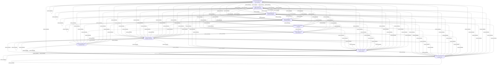

```mermaid
graph TD
fcdcc459-a5a5-4847-a9e3-38f78c505c0f(["non-term (includes clock-hour calendars)"])
58f3948d-883e-47ce-9329-c41882946c97(["Inclusion of Clinical Work in a Standard"])
50d1ce64-d0e6-4f93-a704-84e3e2f3fff2(["extended beyond the normal term beginnin"])
7bf1f0dd-acc2-4af7-83b6-d9413ee4adfd(["Chapter 1 Academic Years, Academic Calen"])
976aaec1-9211-400b-9f17-2041aadc35c0(["BBAY calendar, an academic year could co"])
cb3a5d45-fddf-4f18-9bbd-e2f3ea967a63(["both the credit or clock hours and the w"])
b6e7d064-8015-44bf-a240-c59c6e14543d(["Volume 3 Academic Calendars, Cost of Att"])
eb70803c-cd4d-4115-9ca9-629e8ebea4b7(["Credit or Clock Hours in an Academic Yea"])
d6822279-eab8-4dc3-9fd1-85ebce30a465(["with a preceding or following standard t"])
e0bc1710-ee79-43a6-86ef-abf348af529b(["for a term or payment period, at least o"])
b6e7d064-8015-44bf-a240-c59c6e14543d --|cosine_similarity|--> 7bf1f0dd-acc2-4af7-83b6-d9413ee4adfd
b6e7d064-8015-44bf-a240-c59c6e14543d --|cosine_similarity|--> e0bc1710-ee79-43a6-86ef-abf348af529b
b6e7d064-8015-44bf-a240-c59c6e14543d --|cosine_similarity|--> eb70803c-cd4d-4115-9ca9-629e8ebea4b7
b6e7d064-8015-44bf-a240-c59c6e14543d --|cosine_similarity|--> fcdcc459-a5a5-4847-a9e3-38f78c505c0f
b6e7d064-8015-44bf-a240-c59c6e14543d --|cosine_similarity|--> 976aaec1-9211-400b-9f17-2041aadc35c0
b6e7d064-8015-44bf-a240-c59c6e14543d --|cosine_similarity|--> 50d1ce64-d0e6-4f93-a704-84e3e2f3fff2
b6e7d064-8015-44bf-a240-c59c6e14543d --|cosine_similarity|--> d6822279-eab8-4dc3-9fd1-85ebce30a465
b6e7d064-8015-44bf-a240-c59c6e14543d --|cosine_similarity|--> 58f3948d-883e-47ce-9329-c41882946c97
b6e7d064-8015-44bf-a240-c59c6e14543d --|cosine_similarity|--> cb3a5d45-fddf-4f18-9bbd-e2f3ea967a63
b6e7d064-8015-44bf-a240-c59c6e14543d --|cosine_similarity|--> b6e7d064-8015-44bf-a240-c59c6e14543d
b6e7d064-8015-44bf-a240-c59c6e14543d --|cosine_similarity|--> e0bc1710-ee79-43a6-86ef-abf348af529b
b6e7d064-8015-44bf-a240-c59c6e14543d --|cosine_similarity|--> eb70803c-cd4d-4115-9ca9-629e8ebea4b7
b6e7d064-8015-44bf-a240-c59c6e14543d --|cosine_similarity|--> fcdcc459-a5a5-4847-a9e3-38f78c505c0f
b6e7d064-8015-44bf-a240-c59c6e14543d --|cosine_similarity|--> 976aaec1-9211-400b-9f17-2041aadc35c0
b6e7d064-8015-44bf-a240-c59c6e14543d --|cosine_similarity|--> 50d1ce64-d0e6-4f93-a704-84e3e2f3fff2
b6e7d064-8015-44bf-a240-c59c6e14543d --|cosine_similarity|--> d6822279-eab8-4dc3-9fd1-85ebce30a465
7bf1f0dd-acc2-4af7-83b6-d9413ee4adfd --|cosine_similarity|--> e0bc1710-ee79-43a6-86ef-abf348af529b
7bf1f0dd-acc2-4af7-83b6-d9413ee4adfd --|cosine_similarity|--> eb70803c-cd4d-4115-9ca9-629e8ebea4b7
7bf1f0dd-acc2-4af7-83b6-d9413ee4adfd --|cosine_similarity|--> fcdcc459-a5a5-4847-a9e3-38f78c505c0f
7bf1f0dd-acc2-4af7-83b6-d9413ee4adfd --|cosine_similarity|--> 976aaec1-9211-400b-9f17-2041aadc35c0
7bf1f0dd-acc2-4af7-83b6-d9413ee4adfd --|cosine_similarity|--> 50d1ce64-d0e6-4f93-a704-84e3e2f3fff2
7bf1f0dd-acc2-4af7-83b6-d9413ee4adfd --|cosine_similarity|--> d6822279-eab8-4dc3-9fd1-85ebce30a465
7bf1f0dd-acc2-4af7-83b6-d9413ee4adfd --|cosine_similarity|--> 58f3948d-883e-47ce-9329-c41882946c97
7bf1f0dd-acc2-4af7-83b6-d9413ee4adfd --|cosine_similarity|--> cb3a5d45-fddf-4f18-9bbd-e2f3ea967a63
7bf1f0dd-acc2-4af7-83b6-d9413ee4adfd --|cosine_similarity|--> b6e7d064-8015-44bf-a240-c59c6e14543d
7bf1f0dd-acc2-4af7-83b6-d9413ee4adfd --|cosine_similarity|--> e0bc1710-ee79-43a6-86ef-abf348af529b
7bf1f0dd-acc2-4af7-83b6-d9413ee4adfd --|cosine_similarity|--> eb70803c-cd4d-4115-9ca9-629e8ebea4b7
7bf1f0dd-acc2-4af7-83b6-d9413ee4adfd --|cosine_similarity|--> fcdcc459-a5a5-4847-a9e3-38f78c505c0f
7bf1f0dd-acc2-4af7-83b6-d9413ee4adfd --|cosine_similarity|--> 976aaec1-9211-400b-9f17-2041aadc35c0
7bf1f0dd-acc2-4af7-83b6-d9413ee4adfd --|cosine_similarity|--> 50d1ce64-d0e6-4f93-a704-84e3e2f3fff2
7bf1f0dd-acc2-4af7-83b6-d9413ee4adfd --|cosine_similarity|--> d6822279-eab8-4dc3-9fd1-85ebce30a465
e0bc1710-ee79-43a6-86ef-abf348af529b --|cosine_similarity|--> eb70803c-cd4d-4115-9ca9-629e8ebea4b7
e0bc1710-ee79-43a6-86ef-abf348af529b --|cosine_similarity|--> fcdcc459-a5a5-4847-a9e3-38f78c505c0f
e0bc1710-ee79-43a6-86ef-abf348af529b --|cosine_similarity|--> 976aaec1-9211-400b-9f17-2041aadc35c0
e0bc1710-ee79-43a6-86ef-abf348af529b --|cosine_similarity|--> 50d1ce64-d0e6-4f93-a704-84e3e2f3fff2
e0bc1710-ee79-43a6-86ef-abf348af529b --|cosine_similarity|--> d6822279-eab8-4dc3-9fd1-85ebce30a465
e0bc1710-ee79-43a6-86ef-abf348af529b --|cosine_similarity|--> 58f3948d-883e-47ce-9329-c41882946c97
e0bc1710-ee79-43a6-86ef-abf348af529b --|cosine_similarity|--> cb3a5d45-fddf-4f18-9bbd-e2f3ea967a63
e0bc1710-ee79-43a6-86ef-abf348af529b --|cosine_similarity|--> b6e7d064-8015-44bf-a240-c59c6e14543d
e0bc1710-ee79-43a6-86ef-abf348af529b --|cosine_similarity|--> e0bc1710-ee79-43a6-86ef-abf348af529b
e0bc1710-ee79-43a6-86ef-abf348af529b --|cosine_similarity|--> eb70803c-cd4d-4115-9ca9-629e8ebea4b7
e0bc1710-ee79-43a6-86ef-abf348af529b --|cosine_similarity|--> fcdcc459-a5a5-4847-a9e3-38f78c505c0f
e0bc1710-ee79-43a6-86ef-abf348af529b --|cosine_similarity|--> 976aaec1-9211-400b-9f17-2041aadc35c0
e0bc1710-ee79-43a6-86ef-abf348af529b --|cosine_similarity|--> 50d1ce64-d0e6-4f93-a704-84e3e2f3fff2
e0bc1710-ee79-43a6-86ef-abf348af529b --|cosine_similarity|--> d6822279-eab8-4dc3-9fd1-85ebce30a465
eb70803c-cd4d-4115-9ca9-629e8ebea4b7 --|cosine_similarity|--> fcdcc459-a5a5-4847-a9e3-38f78c505c0f
eb70803c-cd4d-4115-9ca9-629e8ebea4b7 --|cosine_similarity|--> 976aaec1-9211-400b-9f17-2041aadc35c0
eb70803c-cd4d-4115-9ca9-629e8ebea4b7 --|cosine_similarity|--> 50d1ce64-d0e6-4f93-a704-84e3e2f3fff2
eb70803c-cd4d-4115-9ca9-629e8ebea4b7 --|cosine_similarity|--> d6822279-eab8-4dc3-9fd1-85ebce30a465
eb70803c-cd4d-4115-9ca9-629e8ebea4b7 --|cosine_similarity|--> 58f3948d-883e-47ce-9329-c41882946c97
eb70803c-cd4d-4115-9ca9-629e8ebea4b7 --|cosine_similarity|--> cb3a5d45-fddf-4f18-9bbd-e2f3ea967a63
eb70803c-cd4d-4115-9ca9-629e8ebea4b7 --|cosine_similarity|--> b6e7d064-8015-44bf-a240-c59c6e14543d
eb70803c-cd4d-4115-9ca9-629e8ebea4b7 --|cosine_similarity|--> e0bc1710-ee79-43a6-86ef-abf348af529b
eb70803c-cd4d-4115-9ca9-629e8ebea4b7 --|cosine_similarity|--> eb70803c-cd4d-4115-9ca9-629e8ebea4b7
eb70803c-cd4d-4115-9ca9-629e8ebea4b7 --|cosine_similarity|--> fcdcc459-a5a5-4847-a9e3-38f78c505c0f
eb70803c-cd4d-4115-9ca9-629e8ebea4b7 --|cosine_similarity|--> 976aaec1-9211-400b-9f17-2041aadc35c0
eb70803c-cd4d-4115-9ca9-629e8ebea4b7 --|cosine_similarity|--> 50d1ce64-d0e6-4f93-a704-84e3e2f3fff2
eb70803c-cd4d-4115-9ca9-629e8ebea4b7 --|cosine_similarity|--> d6822279-eab8-4dc3-9fd1-85ebce30a465
fcdcc459-a5a5-4847-a9e3-38f78c505c0f --|cosine_similarity|--> 976aaec1-9211-400b-9f17-2041aadc35c0
fcdcc459-a5a5-4847-a9e3-38f78c505c0f --|cosine_similarity|--> 50d1ce64-d0e6-4f93-a704-84e3e2f3fff2
fcdcc459-a5a5-4847-a9e3-38f78c505c0f --|cosine_similarity|--> d6822279-eab8-4dc3-9fd1-85ebce30a465
fcdcc459-a5a5-4847-a9e3-38f78c505c0f --|cosine_similarity|--> 58f3948d-883e-47ce-9329-c41882946c97
fcdcc459-a5a5-4847-a9e3-38f78c505c0f --|cosine_similarity|--> cb3a5d45-fddf-4f18-9bbd-e2f3ea967a63
fcdcc459-a5a5-4847-a9e3-38f78c505c0f --|cosine_similarity|--> b6e7d064-8015-44bf-a240-c59c6e14543d
fcdcc459-a5a5-4847-a9e3-38f78c505c0f --|cosine_similarity|--> e0bc1710-ee79-43a6-86ef-abf348af529b
fcdcc459-a5a5-4847-a9e3-38f78c505c0f --|cosine_similarity|--> eb70803c-cd4d-4115-9ca9-629e8ebea4b7
fcdcc459-a5a5-4847-a9e3-38f78c505c0f --|cosine_similarity|--> fcdcc459-a5a5-4847-a9e3-38f78c505c0f
fcdcc459-a5a5-4847-a9e3-38f78c505c0f --|cosine_similarity|--> 976aaec1-9211-400b-9f17-2041aadc35c0
fcdcc459-a5a5-4847-a9e3-38f78c505c0f --|cosine_similarity|--> 50d1ce64-d0e6-4f93-a704-84e3e2f3fff2
fcdcc459-a5a5-4847-a9e3-38f78c505c0f --|cosine_similarity|--> d6822279-eab8-4dc3-9fd1-85ebce30a465
976aaec1-9211-400b-9f17-2041aadc35c0 --|cosine_similarity|--> 50d1ce64-d0e6-4f93-a704-84e3e2f3fff2
976aaec1-9211-400b-9f17-2041aadc35c0 --|cosine_similarity|--> d6822279-eab8-4dc3-9fd1-85ebce30a465
976aaec1-9211-400b-9f17-2041aadc35c0 --|cosine_similarity|--> 58f3948d-883e-47ce-9329-c41882946c97
976aaec1-9211-400b-9f17-2041aadc35c0 --|cosine_similarity|--> cb3a5d45-fddf-4f18-9bbd-e2f3ea967a63
976aaec1-9211-400b-9f17-2041aadc35c0 --|cosine_similarity|--> b6e7d064-8015-44bf-a240-c59c6e14543d
976aaec1-9211-400b-9f17-2041aadc35c0 --|cosine_similarity|--> e0bc1710-ee79-43a6-86ef-abf348af529b
976aaec1-9211-400b-9f17-2041aadc35c0 --|cosine_similarity|--> eb70803c-cd4d-4115-9ca9-629e8ebea4b7
976aaec1-9211-400b-9f17-2041aadc35c0 --|cosine_similarity|--> fcdcc459-a5a5-4847-a9e3-38f78c505c0f
976aaec1-9211-400b-9f17-2041aadc35c0 --|cosine_similarity|--> 976aaec1-9211-400b-9f17-2041aadc35c0
976aaec1-9211-400b-9f17-2041aadc35c0 --|cosine_similarity|--> 50d1ce64-d0e6-4f93-a704-84e3e2f3fff2
976aaec1-9211-400b-9f17-2041aadc35c0 --|cosine_similarity|--> d6822279-eab8-4dc3-9fd1-85ebce30a465
50d1ce64-d0e6-4f93-a704-84e3e2f3fff2 --|cosine_similarity|--> d6822279-eab8-4dc3-9fd1-85ebce30a465
50d1ce64-d0e6-4f93-a704-84e3e2f3fff2 --|cosine_similarity|--> 58f3948d-883e-47ce-9329-c41882946c97
50d1ce64-d0e6-4f93-a704-84e3e2f3fff2 --|cosine_similarity|--> cb3a5d45-fddf-4f18-9bbd-e2f3ea967a63
50d1ce64-d0e6-4f93-a704-84e3e2f3fff2 --|cosine_similarity|--> b6e7d064-8015-44bf-a240-c59c6e14543d
50d1ce64-d0e6-4f93-a704-84e3e2f3fff2 --|cosine_similarity|--> e0bc1710-ee79-43a6-86ef-abf348af529b
50d1ce64-d0e6-4f93-a704-84e3e2f3fff2 --|cosine_similarity|--> eb70803c-cd4d-4115-9ca9-629e8ebea4b7
50d1ce64-d0e6-4f93-a704-84e3e2f3fff2 --|cosine_similarity|--> fcdcc459-a5a5-4847-a9e3-38f78c505c0f
50d1ce64-d0e6-4f93-a704-84e3e2f3fff2 --|cosine_similarity|--> 976aaec1-9211-400b-9f17-2041aadc35c0
50d1ce64-d0e6-4f93-a704-84e3e2f3fff2 --|cosine_similarity|--> 50d1ce64-d0e6-4f93-a704-84e3e2f3fff2
50d1ce64-d0e6-4f93-a704-84e3e2f3fff2 --|cosine_similarity|--> d6822279-eab8-4dc3-9fd1-85ebce30a465
d6822279-eab8-4dc3-9fd1-85ebce30a465 --|cosine_similarity|--> 58f3948d-883e-47ce-9329-c41882946c97
d6822279-eab8-4dc3-9fd1-85ebce30a465 --|cosine_similarity|--> cb3a5d45-fddf-4f18-9bbd-e2f3ea967a63
d6822279-eab8-4dc3-9fd1-85ebce30a465 --|cosine_similarity|--> b6e7d064-8015-44bf-a240-c59c6e14543d
d6822279-eab8-4dc3-9fd1-85ebce30a465 --|cosine_similarity|--> e0bc1710-ee79-43a6-86ef-abf348af529b
d6822279-eab8-4dc3-9fd1-85ebce30a465 --|cosine_similarity|--> eb70803c-cd4d-4115-9ca9-629e8ebea4b7
d6822279-eab8-4dc3-9fd1-85ebce30a465 --|cosine_similarity|--> fcdcc459-a5a5-4847-a9e3-38f78c505c0f
d6822279-eab8-4dc3-9fd1-85ebce30a465 --|cosine_similarity|--> 976aaec1-9211-400b-9f17-2041aadc35c0
d6822279-eab8-4dc3-9fd1-85ebce30a465 --|cosine_similarity|--> 50d1ce64-d0e6-4f93-a704-84e3e2f3fff2
d6822279-eab8-4dc3-9fd1-85ebce30a465 --|cosine_similarity|--> d6822279-eab8-4dc3-9fd1-85ebce30a465
58f3948d-883e-47ce-9329-c41882946c97 --|cosine_similarity|--> cb3a5d45-fddf-4f18-9bbd-e2f3ea967a63
58f3948d-883e-47ce-9329-c41882946c97 --|cosine_similarity|--> b6e7d064-8015-44bf-a240-c59c6e14543d
58f3948d-883e-47ce-9329-c41882946c97 --|cosine_similarity|--> e0bc1710-ee79-43a6-86ef-abf348af529b
58f3948d-883e-47ce-9329-c41882946c97 --|cosine_similarity|--> eb70803c-cd4d-4115-9ca9-629e8ebea4b7
58f3948d-883e-47ce-9329-c41882946c97 --|cosine_similarity|--> fcdcc459-a5a5-4847-a9e3-38f78c505c0f
58f3948d-883e-47ce-9329-c41882946c97 --|cosine_similarity|--> 976aaec1-9211-400b-9f17-2041aadc35c0
58f3948d-883e-47ce-9329-c41882946c97 --|cosine_similarity|--> 50d1ce64-d0e6-4f93-a704-84e3e2f3fff2
58f3948d-883e-47ce-9329-c41882946c97 --|cosine_similarity|--> d6822279-eab8-4dc3-9fd1-85ebce30a465
cb3a5d45-fddf-4f18-9bbd-e2f3ea967a63 --|cosine_similarity|--> b6e7d064-8015-44bf-a240-c59c6e14543d
cb3a5d45-fddf-4f18-9bbd-e2f3ea967a63 --|cosine_similarity|--> e0bc1710-ee79-43a6-86ef-abf348af529b
cb3a5d45-fddf-4f18-9bbd-e2f3ea967a63 --|cosine_similarity|--> eb70803c-cd4d-4115-9ca9-629e8ebea4b7
cb3a5d45-fddf-4f18-9bbd-e2f3ea967a63 --|cosine_similarity|--> fcdcc459-a5a5-4847-a9e3-38f78c505c0f
cb3a5d45-fddf-4f18-9bbd-e2f3ea967a63 --|cosine_similarity|--> 976aaec1-9211-400b-9f17-2041aadc35c0
cb3a5d45-fddf-4f18-9bbd-e2f3ea967a63 --|cosine_similarity|--> 50d1ce64-d0e6-4f93-a704-84e3e2f3fff2
cb3a5d45-fddf-4f18-9bbd-e2f3ea967a63 --|cosine_similarity|--> d6822279-eab8-4dc3-9fd1-85ebce30a465
b6e7d064-8015-44bf-a240-c59c6e14543d --|cosine_similarity|--> e0bc1710-ee79-43a6-86ef-abf348af529b
b6e7d064-8015-44bf-a240-c59c6e14543d --|cosine_similarity|--> eb70803c-cd4d-4115-9ca9-629e8ebea4b7
b6e7d064-8015-44bf-a240-c59c6e14543d --|cosine_similarity|--> fcdcc459-a5a5-4847-a9e3-38f78c505c0f
b6e7d064-8015-44bf-a240-c59c6e14543d --|cosine_similarity|--> 976aaec1-9211-400b-9f17-2041aadc35c0
b6e7d064-8015-44bf-a240-c59c6e14543d --|cosine_similarity|--> 50d1ce64-d0e6-4f93-a704-84e3e2f3fff2
b6e7d064-8015-44bf-a240-c59c6e14543d --|cosine_similarity|--> d6822279-eab8-4dc3-9fd1-85ebce30a465
e0bc1710-ee79-43a6-86ef-abf348af529b --|cosine_similarity|--> eb70803c-cd4d-4115-9ca9-629e8ebea4b7
e0bc1710-ee79-43a6-86ef-abf348af529b --|cosine_similarity|--> fcdcc459-a5a5-4847-a9e3-38f78c505c0f
e0bc1710-ee79-43a6-86ef-abf348af529b --|cosine_similarity|--> 976aaec1-9211-400b-9f17-2041aadc35c0
e0bc1710-ee79-43a6-86ef-abf348af529b --|cosine_similarity|--> 50d1ce64-d0e6-4f93-a704-84e3e2f3fff2
e0bc1710-ee79-43a6-86ef-abf348af529b --|cosine_similarity|--> d6822279-eab8-4dc3-9fd1-85ebce30a465
eb70803c-cd4d-4115-9ca9-629e8ebea4b7 --|cosine_similarity|--> fcdcc459-a5a5-4847-a9e3-38f78c505c0f
eb70803c-cd4d-4115-9ca9-629e8ebea4b7 --|cosine_similarity|--> 976aaec1-9211-400b-9f17-2041aadc35c0
eb70803c-cd4d-4115-9ca9-629e8ebea4b7 --|cosine_similarity|--> 50d1ce64-d0e6-4f93-a704-84e3e2f3fff2
eb70803c-cd4d-4115-9ca9-629e8ebea4b7 --|cosine_similarity|--> d6822279-eab8-4dc3-9fd1-85ebce30a465
fcdcc459-a5a5-4847-a9e3-38f78c505c0f --|cosine_similarity|--> 976aaec1-9211-400b-9f17-2041aadc35c0
fcdcc459-a5a5-4847-a9e3-38f78c505c0f --|cosine_similarity|--> 50d1ce64-d0e6-4f93-a704-84e3e2f3fff2
fcdcc459-a5a5-4847-a9e3-38f78c505c0f --|cosine_similarity|--> d6822279-eab8-4dc3-9fd1-85ebce30a465
976aaec1-9211-400b-9f17-2041aadc35c0 --|cosine_similarity|--> 50d1ce64-d0e6-4f93-a704-84e3e2f3fff2
976aaec1-9211-400b-9f17-2041aadc35c0 --|cosine_similarity|--> d6822279-eab8-4dc3-9fd1-85ebce30a465
50d1ce64-d0e6-4f93-a704-84e3e2f3fff2 --|cosine_similarity|--> d6822279-eab8-4dc3-9fd1-85ebce30a465
```
